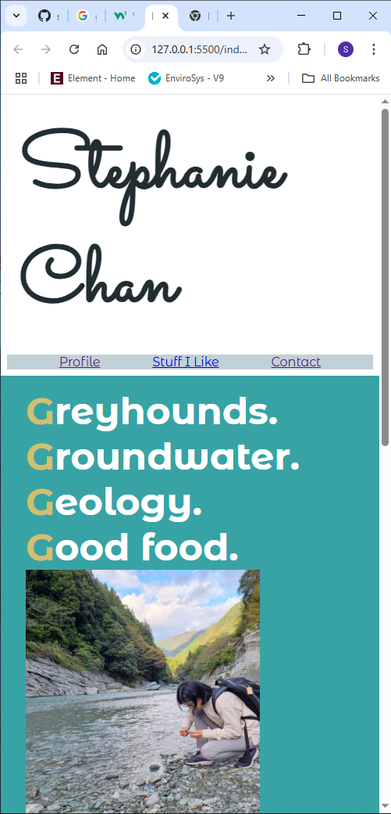

# stephanite9.github.io

#  Stephanie Chan - Portfolio Task
​
[My portfolio site](https://stephanite9.github.io/)
​
## Project Requirements

### Content
 Add a short paragraph describing the features below. What aesthetic and technical choices did you make? 
- [ ] At least one profile picture 
- [ ] Biography (at least 100 words)
- [ ] Functional Contact Form
- [ ] "Projects" section
- [ ] Links to external sites, e.g. GitHub and LinkedIn.

- My homepage consists of a profile picture (me hunting for nice river rocks in the Iya Valley river in Japan), projects section (with not much), links to external sites. The colour scheme is based off the profile pic. I included the required biography, through the Profile link at the top. The contact form is through the Contact link at the top. I would like to make the page links into a hamburger menu, but ran out of time. Once I have more portfolio work, I'd like to expand the individual project sections to include a picture, and arrange in a column down the page, which would expand to a wider formation layout in wider screens. I had a hard time designing the home page, as I felt like I didn't have a good idea of what I wanted to present - I only had my river theme profile pic (which I really like as I feel it represents my vibe and my interests), but I should have put more effort into building out the wireframe for wide screen. It looked OK  on small screen as I didn't have much content, but then when I started working on the wider screen I panicked as I had so much blank space and it looked ridiculous.
​
### Technical
 Add a short paragraph describing the features below. What strategies or design decisions did you work from? 
- [ ] At least 2 web pages.
- [ ] Version controlled with Git
- [ ] Deployed on GitHub pages.
- [ ] Implements responsive design principles.
- [ ] Uses semantic HTML.

- There are 3 web pages (main homepage, profile and contact form page). They all have the same header, except for the contact form page which has no hero section. Version controlled on Git, with comments. I have some responsive design, though its mainly through flexboxes and variable padding to restrict the spread when moving to wide screen...As I said, I would like to add a hamburger menu and further layout switches. In future, I would more carefully plan the layout changes between mobile and widescreen as I did not take into account the huge change in available space when initally designing. 

### Bonus (optional)
 Add a short paragraph describing the features below, if you included any. 
- [ ] Different styles for active, hover and focus states.
- [ ] Include JavaScript to add some dynamic elements to your site. (Extra tricky!)

- I have some hover stuff over the main links at the top of the page. It doesn't add anything meaningful, aethetically or functionally, but I just did it for funsies.
​
### Screenshots
> Please include the following:
> - The different pages and features of your website on mobile, tablet and desktop screen sizes (multiple screenshots per page and screen size).
> - The different features of your site, e.g. if you have hover states, take a screenshot that shows that.  
> 
> You can do this by saving the images in a folder in your repo, and including them in your readme document with the following Markdown code: 

####  contact page on mobile 

####  contact page on wide 

####  home page on mobile 

####  home page on mobile 

####  home page on wide 

####  home page on wide 

####  hover state 

####  profile page on mobile 

####  profile page on wide 
